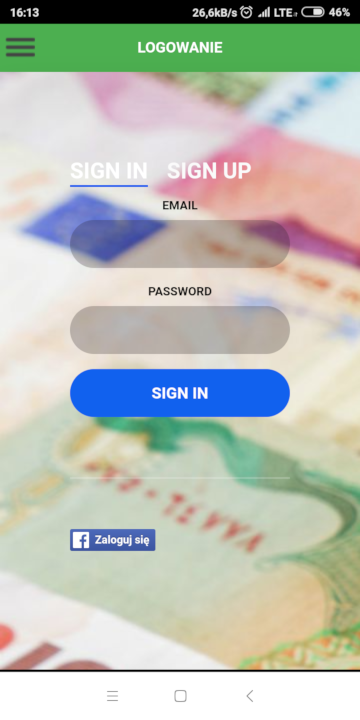
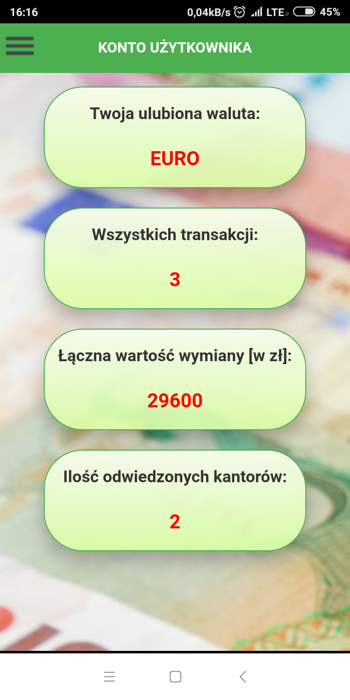
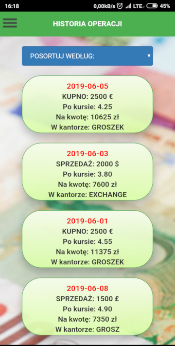

[Strona główna](./README.md)

# Funkcjonalności #

Aplikacja **Forex Offline** posiada kilka podstawowych funkcjonalności:

  * Wyszukiwanie najlepszych ofert kupna/sprzedaży w kantorach
  * Akcje użytkownika: rejestracja i logowanie
  * Tworzenie historii transakcji (tylko dla zalogowanego użytkownika) 
  * Odtwarzanie historii transakcji (tylko dla zalogowanego użytkownika)

W tym miejscu warto zaznaczyć, że po określeniu, która oferta jest wybrana przez użytkownika, aplikacja automatycznie przechodzi do nawigacji do wybranego punktu wymiany walut.

# Zrzuty ekranu #

  
**Obraz 1.:** Ekran wyszukiwania najlepszej oferty kupna lub sprzedaży.

  
**Obraz 2.:** Wyniki wyszukiwania oferty sprzedaży Euro.

  
**Obraz 3.:** Spersonalizowana trasa dojazdu do kantoru Centuś.

()[https://einstein13.github.io/bogate_dokumentacja/images/004_zaloguj.png]  
**Obraz 4.:** Ekran logowania użytkownika.

  
**Obraz 5.:** Widok ogólny historii transakcji.

  
**Obraz 6.:** Widok szczegółowy historii transakcji.
