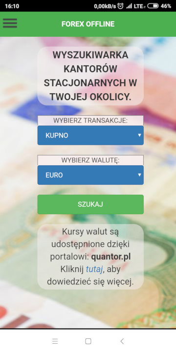

[Strona główna](./README.md)

# Funkcjonalności #

Aplikacja **Forex Offline** posiada kilka podstawowych funkcjonalności:

  * Wyszukiwanie najlepszych ofert kupna/sprzedaży w kantorach
  * Akcje użytkownika: rejestracja i logowanie
  * Tworzenie historii transakcji (tylko dla zalogowanego użytkownika) 
  * Odtwarzanie historii transakcji (tylko dla zalogowanego użytkownika)

W tym miejscu warto zaznaczyć, że po określeniu, która oferta jest wybrana przez użytkownika, aplikacja automatycznie przechodzi do nawigacji do wybranego punktu wymiany walut.

# Zrzuty ekranu #

